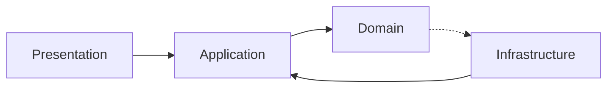

# AdminCraft — Project Context & Developer Guide

## Technology Stack

- **Backend**: Spring Boot 3.3.5, Java 21, Spring Data JPA, MySQL, Flyway, Resilience4j
- **Frontend**: Angular 19, TypeScript 5.6.3, Signals, RxJS 7, Material Design, TailwindCSS
- **Architecture**: Multi-Tenant Clean Architecture (Database-per-tenant)

---

## Environment & Operations (Windows OS)

- **OS**: Windows (Primary development environment)
- **Shell**: PowerShell or CMD
- **Commands**: Use Windows-compatible commands (e.g., `;` instead of `&&` in some shells, or just follow PowerShell syntax).

### Quick Start

```powershell
# Infrastructure
docker compose up -d

# Backend (root)
mvn spring-boot:run -Dspring-boot.run.profiles=dev

# Frontend (storefront/)
cd storefront; npm install; npm run start
```

### Health & Monitoring

- **Swagger UI**: `http://localhost:8080/api/swagger-ui/index.html`
- **Actuator Health**: `http://localhost:8080/actuator/health`

---

## Clean Architecture



### Rules & Responsibilities

- **Presentation**: Controllers, Request/Response DTOs. No business logic.
- **Application**: Business logic (calculations, transformations), orchestration.
- **Domain**: Pure logic, Entities, Repository Interfaces, Enums. No dependencies.
- **Infrastructure**: Config, Repository Implementations, Multi-tenancy adapters.

**CRITICAL**: All business logic (calculations, aggregations) must be in the **Application Layer**. Frontend is for display and data capture only.

---

## Multi-Tenancy (Database-per-Tenant)

- **Isolation**: Physical isolation via separate databases (`ac_tenant_{id}`).
- **Platform DB**: `platform_management` (control plane).
- ❌ **NO tenant_id columns**: Enforced at the database connection level.
- ✅ **TenantContext**: ThreadLocal storage for `tenantId` and `tenantDbName`.
- ✅ **Context Flow**: `TenantFilter` sets context in `try-finally` for safety.
- ✅ **MDC Logging**: Every log includes `tenantId`, `tenantDb`, and `correlationId`.

---

## Naming Conventions

| Element        | Backend (Java)    | Frontend (TS/Angular)      | Database (SQL)   |
| -------------- | ----------------- | -------------------------- | ---------------- |
| **Class**      | `PascalCase`      | `Spa{Name}Component`       | -                |
| **Method/Var** | `camelCase`       | `camelCase` / `varSig`     | `snake_case`     |
| **Signals**    | -                 | `itemsSig`, `isLoadingSig` | -                |
| **Private**    | `private`         | `#privateField`            | -                |
| **Protected**  | `protected`       | `protectedField`           | -                |
| **File**       | `PascalCase.java` | `kebab-case.ts`            | `V{n}__desc.sql` |

---

## Database Migrations (Flyway)

- **Versioning**: Global Sequential Versioning.
- **Rules**: `hibernate.ddl-auto=none`, `utf8mb4` encoding, No idempotent DDL.
- **Version Bundles**:
  - `V1-V2`: **Core** (Users, Roles, Sites)
  - `V3`: **PageBuilder** (Pages, Categories)
  - `V4-V5`: **ComponentLibrary** (Components, Types)
  - `V6-V7`: **Media** Module
  - `V8+`: Future modules.

---

## Quality & Standards

### Frontend Patterns

- **State**: Signals for local/UI state, RxJS for event streams.
- **Lifecycle**: `OnPush` detection, standalone components, `spa-` prefix.
- **DRY**: Extend `BaseCrudListComponent`, `BaseCrudFormComponent`, and `CrudHttpService`.
- **Subscriptions**: Always use `take(1)` or `takeUntil(#destroy$)`.
- **UI Components**: Use form fields from `shared/components/custom-ui/`.

### Security (OWASP)

- **Validation**: Strict Bean Validation (`@Valid`, `@NotNull`) on DTOs.
- **Database**: Parameterized JPQL only (protect against SQL Injection).
- **Rate Limiting**: 5 req/min (Provisioning), 100 req/min (CMS Delivery).
- **Errors**: Truncate API messages (500 chars), log full traces internally.
