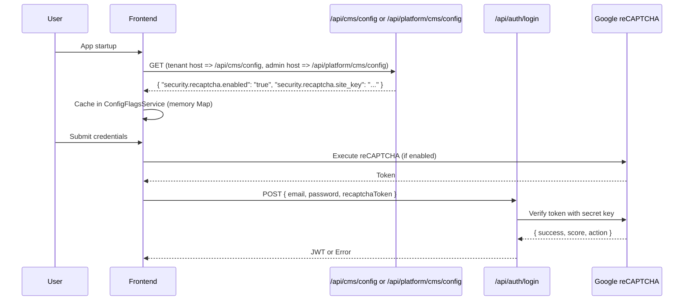

# Authentication

AdminCraft supports two login modes via the same endpoint:

- **Tenant user login** (tenant-scoped)
- **Platform admin login (SUPER_ADMIN)** (no tenant)

## Source of Truth

| Component | Location |
|-----------|----------|
| Auth Controller | [`backend/.../controller/AuthController.java`](../../backend/src/main/java/com/backend/presentation/controller/AuthController.java) |
| Auth Service | [`backend/.../service/impl/AuthenticationServiceImpl.java`](../../backend/src/main/java/com/backend/application/service/impl/AuthenticationServiceImpl.java) |
| Email Service | [`backend/.../service/impl/EmailServiceImpl.java`](../../backend/src/main/java/com/backend/application/service/impl/EmailServiceImpl.java) |
| OTP Service | [`backend/.../service/impl/OtpServiceImpl.java`](../../backend/src/main/java/com/backend/application/service/impl/OtpServiceImpl.java) |
| Trusted Device Service | [`backend/.../service/impl/TrustedDeviceServiceImpl.java`](../../backend/src/main/java/com/backend/application/service/impl/TrustedDeviceServiceImpl.java) |
| Verification Token Entity | [`backend/.../entity/VerificationToken.java`](../../backend/src/main/java/com/backend/domain/entity/VerificationToken.java) |
| Email Templates | `backend/src/main/resources/templates/email/` |

## API Endpoints

Base path: `/api/auth`

| Method | Path | Description | Auth Required |
|--------|------|-------------|---------------|
| `POST` | `/login` | User login (may trigger 2FA) | No |
| `POST` | `/verify-otp` | Verify OTP code for 2FA | No |
| `POST` | `/refresh` | Refresh access token (may trigger 2FA if policy changed) | Bearer token |
| `POST` | `/logout` | Logout user | Bearer token |
| `POST` | `/forgot-password` | Request password reset email | No |
| `POST` | `/reset-password` | Reset password with token | No |
| `GET` | `/verify-reset-token` | Validate reset token | No |
| `POST` | `/set-initial-password` | New user sets password (no JWT returned) | No |

## Tenant User Login

Tenant can be supplied in two ways:

1) Header-based:
   - `X-Tenant-ID: {id}` (takes precedence)
   - `X-Tenant-Subdomain: {subdomain}`

2) Body-based fallback:
   - `LoginRequest.subdomain` (used when `X-Tenant-Subdomain` is not provided)

### Special case: `admin` subdomain

If `subdomain == "admin"`, the system routes the login attempt to **platform admin authentication**.

## Platform Admin Login (SUPER_ADMIN)

If no tenant identifier is provided (`tenantId == null` and empty subdomain), the login attempt is treated as a platform admin login.

Platform admins are stored in the platform database (`platform_management`) and receive JWTs with:
- `role = SUPER_ADMIN`
- `tenantId = null`

### OTP Verification Routing Rules

The `POST /api/auth/verify-otp` endpoint handles both platform admin and tenant user OTP verification. The system determines the routing based on request parameters:

**Platform Admin OTP:**
- `tenantId == null` AND (`subdomain == null` OR `subdomain == "admin"`)
- Routes to platform admin verification flow
- Validates OTP against `platform_verification_tokens` table

**Tenant User OTP:**
- `tenantId != null`
- Routes to tenant user verification flow
- Validates OTP against tenant database `verification_tokens` table

**Client Contract:**
Clients MUST send consistent `tenantId` and `subdomain` values across the entire authentication flow (`POST /api/auth/login` → `POST /api/auth/verify-otp`):
- **Platform Admin:** Always send `tenantId=null` and `subdomain="admin"`
- **Tenant User:** Always send the same `tenantId` and `subdomain` used in initial login

**Example Requests:**
```json
// Platform Admin
POST /api/auth/verify-otp
{
  "tenantId": null,
  "subdomain": "admin",
  "pendingToken": "...",
  "otpCode": "123456"
}

// Tenant User
POST /api/auth/verify-otp
{
  "tenantId": 42,
  "subdomain": "acme",
  "pendingToken": "...",
  "otpCode": "123456"
}
```

## Refresh Token

Token refresh uses the Authorization header:
- `Authorization: Bearer {refreshToken}`

The refresh flow detects whether the token belongs to a platform admin or a tenant user and issues a new access token accordingly.

### 2FA Policy Enforcement on Refresh

**If the tenant's 2FA policy is `REQUIRED`**, the refresh endpoint also checks whether the device is trusted. If not trusted, the response is identical to the 2FA-required login response — the client must complete OTP verification before receiving a new JWT.

This means: a user who logged in while 2FA was `DISABLED`, then the admin enables `REQUIRED`, will be challenged on their next token refresh.

**Headers**:
| Header | Required | Description |
|--------|----------|-------------|
| `Authorization` | Yes | `Bearer {refreshToken}` |
| `X-Device-Fingerprint` | No | SHA-256 device fingerprint (same value used at OTP verify) |

**Response when 2FA required** (same shape as login):
```json
{
  "result": "SUCCESS",
  "data": {
    "requires2FA": true,
    "pendingToken": "abc123-session-token",
    "maskedEmail": "u***@example.com",
    "subdomain": "acme",
    "tenantId": 1
  }
}
```

The client should redirect to the OTP form — `POST /auth/verify-otp` completes the flow and returns a new JWT.

---

## Two-Factor Authentication (2FA)

AdminCraft supports:
- **Tenant-level 2FA** with email OTP and trusted device management
- **Platform admin (SUPER_ADMIN) 2FA** with email OTP (always OTP when policy is required, no trusted-device bypass)

### 2FA Policy Levels

2FA is controlled at the **tenant level** (all-or-nothing per tenant). There is no per-user toggle.

Configured per scope:
- Tenant users: Site Dashboard → Security tab
- SUPER_ADMIN users: Platform Settings → Security section

| Policy | Behavior |
|--------|----------|
| `DISABLED` | 2FA not used, standard login |
| `REQUIRED` | 2FA mandatory for all tenant users (or all platform admins) |

For SUPER_ADMIN, the same policy values are used globally from platform settings:
- `DISABLED`: platform login behaves as standard email/password
- `REQUIRED`: platform login always returns `requires2FA` and requires OTP verification

> **Policy enforcement applies at login AND token refresh.** If a tenant admin changes policy from `DISABLED` to `REQUIRED`, active sessions will be challenged on their next token refresh (see [Refresh Token](#refresh-token)).

### Login Flow with 2FA

```
POST /api/auth/login
├── Validate credentials
├── Check tenant 2FA policy
│   └── If DISABLED → Return JWT immediately
│   └── If REQUIRED → Always require 2FA
├── Check trusted device (if 2FA required)
│   └── If trusted → Return JWT immediately
│   └── If not trusted → Generate OTP
├── Send OTP email
└── Return { requires2FA: true, pendingToken: "..." }
```

### Login Response

**Standard login (no 2FA)**:
```json
{
  "result": "SUCCESS",
  "data": {
    "accessToken": "eyJ...",
    "refreshToken": "eyJ...",
    "tokenType": "Bearer",
    "expiresIn": 3600
  }
}
```

**2FA required**:
```json
{
  "result": "SUCCESS",
  "data": {
    "requires2FA": true,
    "pendingToken": "abc123-session-token",
    "maskedEmail": "u***@example.com",
    "subdomain": "acme",
    "tenantId": 1
  }
}
```

### OTP Verification

```
POST /api/auth/verify-otp

Request:
{
  "pendingToken": "abc123-session-token",
  "otpCode": "123456",
  "subdomain": "acme",
  "tenantId": 1,
  "trustDevice": true,
  "deviceFingerprint": "sha256-hash"
}

Response (success):
{
  "result": "SUCCESS",
  "data": {
    "accessToken": "eyJ...",
    "refreshToken": "eyJ...",
    ...
  }
}
```

**Validation**:
- `deviceFingerprint`: Max 128 chars, alphanumeric with underscore/hyphen only (`[A-Za-z0-9_-]*`)
- `otpCode`: Exactly 6 digits

**Error Responses**:
- `401 Unauthorized`: Invalid OTP code or expired session
- `429 Too Many Requests`: OTP request rate limit exceeded (3 per 5 minutes)

### OTP Configuration

| Parameter | Value | Environment |
|-----------|-------|-------------|
| OTP Length | 6 digits | All |
| OTP Expiry | 5 minutes | All |
| Max Attempts | 5 | All |
| Request Rate Limit | 3 per 5 minutes | All |
| Rate Limit Cleanup | Every 5 minutes | All |
| Bypass Code | `123456` | Dev only (auto-disabled in prod) |

Configuration in `application.yml`:
```yaml
app:
  otp:
    length: 6
    expiry-seconds: 300
    max-attempts: 5
    bypass-code: null  # Set to "123456" in dev profile
```

**Security Notes**:
- OTP codes are stored as SHA-256 hashes (never plaintext)
- Bypass code is automatically disabled in non-dev profiles via `@PostConstruct` validation
- Rate limiting: Max 3 OTP requests per email per 5-minute window (returns HTTP 429)

---

## Trusted Devices

Users can opt to "trust this device" during OTP verification, skipping 2FA for future logins from the same device.

### Device Fingerprint

Frontend generates a device fingerprint using:
- Browser name and version
- Operating system
- Screen resolution
- Timezone
- Canvas fingerprint hash

The fingerprint is SHA-256 hashed before sending to backend.

### Trusted Device Lifecycle

| Parameter | Value |
|-----------|-------|
| Trust Duration | 30 days |
| Storage | `trusted_devices` table (tenant DB) |
| Cleanup | Automatic expiry check on login |

### Database Schema

```sql
CREATE TABLE trusted_devices (
    id BIGINT PRIMARY KEY AUTO_INCREMENT,
    user_id BIGINT NOT NULL,
    device_fingerprint VARCHAR(64) NOT NULL,
    device_name VARCHAR(100),
    browser VARCHAR(50),
    os VARCHAR(50),
    ip_address VARCHAR(45),
    trusted_at DATETIME,
    last_used_at DATETIME,
    expires_at DATETIME NOT NULL,
    UNIQUE KEY uk_user_device (user_id, device_fingerprint),
    FOREIGN KEY (user_id) REFERENCES users(id) ON DELETE CASCADE
);
```

---

## Password Reset (Token-Based)

Secure password reset flow using email tokens.

### Flow

```
1. POST /api/auth/forgot-password { "email": "user@example.com" }
   └── Generate token, send email
   └── Response: { "result": "SUCCESS", "message": "Reset link sent" }

2. User clicks email link → Frontend reset-password page
   └── GET /api/auth/verify-reset-token?token=abc123
   └── Response: { "valid": true, "email": "u***@example.com" }

3. POST /api/auth/reset-password
   {
     "token": "abc123",
     "password": "NewPass123!",
     "confirmPassword": "NewPass123!"
   }
   └── Response: { "result": "SUCCESS", "message": "Password changed" }
   └── email_verified=true is set (user proved email access by clicking the reset link)
```

> **Note**: Password reset sets `email_verified = true`. This is intentional — the user proved ownership of the email address by clicking the reset link. Without this, a `TENANT_USER` with `email_verified = false` could reset their password but still be unable to log in.

### Token Configuration

| Parameter | Value |
|-----------|-------|
| Token Type | UUID (stored as SHA-256 hash) |
| Expiry | 1 hour |
| Single Use | Yes (marked USED after reset) |

---

## Email Verification (New Users)

New users created by admin receive a verification email to set their password.

### Flow

```
1. Admin creates user (no password)
   └── POST /api/users { email, firstName, ... } (no password fields)
   └── User created with email_verified=false, temporary password hash generated
   └── Note: Temporary hash is passwordEncoder.encode(UUID.randomUUID().toString())
   └── User cannot login with temporary password (unknown value)
   └── Verification email sent automatically

2. User clicks email link → Frontend set-password page
   └── Token validated
   └── User sets password

3. POST /api/auth/set-initial-password
   {
     "token": "abc123",
     "password": "SecurePass123!",
     "confirmPassword": "SecurePass123!"
   }
   └── email_verified=true, password set
   └── Response: { "result": "SUCCESS", "message": "..." } — no JWT returned
   └── Frontend redirects to sign-in; user logs in normally (2FA applies if policy requires it)
```

> **Note**: `POST /auth/set-initial-password` returns `ApiResponse<Void>` — no access token or refresh token. The client must proceed to `/sign-in` for a fresh login. This ensures 2FA policy is enforced on first login.

### Token Configuration

| Parameter | Value |
|-----------|-------|
| Token Type | `EMAIL_VERIFY` |
| Expiry | 24 hours |
| Single Use | Yes |

---

## Verification Tokens

All email-based verification uses the `verification_tokens` table.

### Token Types

| Type | Purpose | Expiry |
|------|---------|--------|
| `EMAIL_VERIFY` | New user email verification | 24 hours |
| `PASSWORD_RESET` | Password reset | 1 hour |
| `LOGIN_OTP` | 2FA login OTP | 5 minutes |
| `OPERATION_OTP` | Sensitive operation OTP | 5 minutes |

### Token Status

| Status | Description |
|--------|-------------|
| `ACTIVE` | Token is valid and can be used |
| `USED` | Token has been consumed |
| `EXPIRED` | Token has passed expiry time |
| `REVOKED` | Token manually invalidated |

### Database Schema

```sql
CREATE TABLE verification_tokens (
    id BIGINT PRIMARY KEY AUTO_INCREMENT,
    user_id BIGINT NOT NULL,
    token_hash VARCHAR(64) NOT NULL,
    token_type ENUM('EMAIL_VERIFY', 'PASSWORD_RESET', 'LOGIN_OTP', 'OPERATION_OTP'),
    status ENUM('ACTIVE', 'USED', 'EXPIRED', 'REVOKED'),
    target_value VARCHAR(255),  -- OTP: SHA-256 hash; PASSWORD_RESET/EMAIL_VERIFY: null
    expires_at DATETIME NOT NULL,
    attempt_count INT DEFAULT 0,
    max_attempts INT DEFAULT 5,
    used_at DATETIME,
    ip_address VARCHAR(45),
    user_agent VARCHAR(500),
    created_at DATETIME,
    FOREIGN KEY (user_id) REFERENCES users(id) ON DELETE CASCADE
);
```

**Note**:
- For `LOGIN_OTP` and `OPERATION_OTP` tokens, the `target_value` field stores the SHA-256 hash of the OTP code, not the plaintext value. This ensures OTP codes cannot be extracted from the database.
- For `PASSWORD_RESET` and `EMAIL_VERIFY` tokens, `target_value` is `null`. The plaintext token is only returned to the caller for email sending and is never stored in the database.

---

## Email Service

### Providers

| Provider | Usage | Configuration |
|----------|-------|---------------|
| `smtp` | Production | JavaMailSender with SMTP credentials |
| `console` | Development | Logs email content to console |

### Email Templates

Located in `backend/src/main/resources/templates/email/`:

| Template | Purpose |
|----------|---------|
| `otp-login-{lang}.html` | 2FA OTP code |
| `password-reset-{lang}.html` | Password reset link |
| `email-verify-{lang}.html` | New user verification |

Languages supported: `tr`, `en`

### Configuration

```yaml
# application-prod.yml
spring:
  mail:
    host: ${SMTP_HOST}
    port: ${SMTP_PORT:587}
    username: ${SMTP_USERNAME}
    password: ${SMTP_PASSWORD}
    properties:
      mail.smtp.starttls.enable: true

app:
  email:
    enabled: true
    provider: smtp
    from-address: noreply@craftive.io
    from-name: AdminCraft

# application-dev.yml
app:
  email:
    provider: console
    log-content: true
```

---

## Frontend Integration

### Components

**Location**: `storefront/src/app/modules/auth/`

| Component | Route | Purpose |
|-----------|-------|---------|
| `sign-in/` | `/sign-in` | User login with 2FA support |
| `forgot-password/` | `/forgot-password` | Request password reset email |
| `reset-password/` | `/reset-password?token=...` | Reset password with token |
| `set-password/` | `/set-password?token=...` | New user sets initial password |

### Sign-In Component (2FA)

**Features**:
- Standard email/password login
- OTP verification form (shown when 2FA required)
- Device fingerprint generation
- "Trust this device" checkbox
- Auto-redirect after OTP verification

**Flow**:
```typescript
1. User enters credentials → signIn()
2. If requires2FA === true:
   - Show OTP form
   - User enters 6-digit code
   - Optional: Check "Trust this device"
   - Call verifyOtp()
3. If successful → Redirect to dashboard
```

### Reset Password Component

**Location**: `storefront/src/app/modules/auth/reset-password/`

**Features**:
- Extracts token from URL query parameter (`?token=...`)
- Resolves tenant from hostname (`extractSubdomainFromHost()`) only
- Validates token on component init
- Shows loading state during validation
- Password form with confirmation
- Password visibility toggle
- Backend-aligned password validation (`min 8 + uppercase + lowercase + digit`)
- Auto-redirect to sign-in after success (3 seconds)

**Implementation**:
```typescript
ngOnInit():
  - Extract token from route.snapshot.queryParamMap
  - Resolve tenant subdomain from host (fail-closed if unavailable)
  - Call authService.verifyResetToken(token, subdomain)
  - If valid → Show password form
  - If invalid → Show error alert

resetPassword():
  - Validate passwords match
  - Call authService.resetPassword(token, password, confirmPassword, subdomain, recaptchaToken)
  - On success → Show `response.message` (fallback i18n) → Redirect to /sign-in
```

### Set Password Component (New Users)

**Location**: `storefront/src/app/modules/auth/set-password/`

**Features**:
- Extracts token from URL query parameter (`?token=...`)
- Resolves tenant from hostname (`extractSubdomainFromHost()`) only
- Validates email verification token on component init
- Shows masked email address
- Password form with confirmation
- Password visibility toggle
- Backend-aligned password validation (`min 8 + uppercase + lowercase + digit`)
- Auto-redirect to sign-in after success (3 seconds)

**Implementation**:
```typescript
ngOnInit():
  - Extract token from route.snapshot.queryParamMap
  - Resolve tenant subdomain from host (fail-closed if unavailable)
  - Call authService.verifyEmailToken(token, subdomain)
  - If valid → Show password form + masked email
  - If invalid → Show error alert

setPassword():
  - Validate passwords match
  - Call authService.setInitialPassword(token, password, confirmPassword, subdomain, recaptchaToken)
  - On success → Show `response.message` (fallback i18n) → Redirect to /sign-in
  - Note: no JWT in response — the redirect to sign-in is mandatory, not optional
```

### Forgot Password Component

**Location**: `storefront/src/app/modules/auth/forgot-password/`

**Features**:
- Email input form
- Email validation
- Shows backend `response.message` (fallback i18n)
- Loading state during API call

**Implementation**:
```typescript
sendResetLink():
  - Validate email format
  - Call authService.forgotPassword(email, subdomain, recaptchaToken)
  - Show backend `response.message` (or fallback i18n)
  - Reset form
```

### Auth Service Methods

**Location**: `storefront/src/app/core/auth/auth.service.ts`

```typescript
// Password Reset
forgotPassword(email: string, subdomain?: string, recaptchaToken?: string): Observable<any>
verifyResetToken(token: string, subdomain?: string): Observable<any>
resetPassword(token: string, password: string, confirmPassword: string, subdomain?: string, recaptchaToken?: string): Observable<any>

// Email Verification
verifyEmailToken(token: string, subdomain?: string): Observable<any>
setInitialPassword(token: string, password: string, confirmPassword: string, subdomain?: string, recaptchaToken?: string): Observable<any>
// Returns ApiResponse<void> — no JWT. Redirect to sign-in after success.

// 2FA
signIn(credentials): Observable<boolean | 'requires2FA'>
verifyOtp(request: VerifyOtpRequest): Observable<boolean>
cancel2FA(): void
```

### Account Lock Handling (Frontend)

- Frontend **does not** cache lock state locally.
- Every sign-in attempt is sent to backend.
- Backend is source of truth for lock checks and `remainingMinutes`.
- Frontend only displays backend error/message (`ACCOUNT_LOCKED`).

### Device Fingerprint Generation

**Location**: `storefront/src/app/modules/auth/sign-in/sign-in.component.ts`

```typescript
async generateDeviceFingerprint(): Promise<string> {
  const components = [
    navigator.userAgent,
    navigator.language,
    screen.colorDepth,
    screen.width + 'x' + screen.height,
    new Date().getTimezoneOffset(),
  ];

  const fingerprint = components.join('|');
  const encoder = new TextEncoder();
  const data = encoder.encode(fingerprint);
  const hashBuffer = await crypto.subtle.digest('SHA-256', data);
  const hashArray = Array.from(new Uint8Array(hashBuffer));
  return hashArray.map(b => b.toString(16).padStart(2, '0')).join('');
}
```

### Routes Configuration

**Location**: `storefront/src/app/app.routes.ts`

```typescript
{
  path: '',
  children: [
    { path: 'sign-in', loadChildren: () => import('.../sign-in.routes') },
    { path: 'forgot-password', loadChildren: () => import('.../forgot-password.routes') },
    { path: 'reset-password', loadChildren: () => import('.../reset-password.routes') },
    { path: 'set-password', loadChildren: () => import('.../set-password.routes') },
  ]
}
```

---

## Security Considerations

### Token Security

- All tokens stored as SHA-256 hashes in `token_hash` column
- OTP codes (LOGIN_OTP, OPERATION_OTP): stored as SHA-256 hash in `target_value`
- PASSWORD_RESET and EMAIL_VERIFY: `target_value` is `null` (plaintext never stored in DB)
- Tokens are single-use (status changes to USED after consumption)
- Automatic expiry enforcement
- Rate limiting on verification attempts (max 5)
- Expired `ACTIVE` tokens are also cleaned up by the scheduled job (7-day grace window)

### OTP Security

- 6-digit numeric codes (cryptographically random)
- **Hash-based storage** (OTP codes stored as SHA-256 hash, never plaintext)
- **Constant-time comparison** (`MessageDigest.isEqual()`) used during OTP validation — prevents timing attacks
- 5-minute expiry window
- Max 5 verification attempts before token invalidation
- **Request rate limiting**: Max 3 OTP requests per email per 5-minute window
- **Rate limiter cleanup**: Scheduled task removes expired entries every 5 minutes (prevents memory leak)
- IP address and user agent logged
- **Bypass code protection**: Automatically disabled in non-dev profiles

### Password Security

- Minimum 8 characters required
- **Complexity requirements**: At least 1 lowercase, 1 uppercase, and 1 digit
- Pattern: `^(?=.*[a-z])(?=.*[A-Z])(?=.*\d).{8,}$`
- Frontend form validators are aligned with backend pattern
- BCrypt hashing for storage
- Password confirmation validated at DTO layer via `@AssertTrue`

### Device Trust

- Device fingerprint is SHA-256 hashed
- **Fingerprint validation**: Alphanumeric with underscore/hyphen only, max 128 chars
- 30-day trust expiry
- Automatic cleanup of expired devices
- User can revoke all trusted devices

### Input Validation

- **X-Forwarded-For validation**: IP addresses validated against IPv4/IPv6 patterns
- **Device fingerprint pattern**: Only `[A-Za-z0-9_-]` characters allowed
- Invalid inputs are rejected or sanitized before processing

### Audit Trail

All authentication events are logged with:
- User ID
- IP address (validated format)
- User agent
- Timestamp
- Success/failure status

### PII Protection (GDPR Compliance)

**Logging Policy**:
- ❌ **No raw email addresses in logs**
- ✅ **userId** used for user identification
- ✅ **maskEmail()** used when email display is necessary (e.g., `u***@example.com`)
- ✅ **MDC Context** populated in all tenant operations:
  - `tenantId`: Tenant identifier
  - `tenantDb`: Tenant database name
  - `correlationId`: Request correlation UUID

**MDC Population**: All TenantContext blocks populate MDC for distributed tracing and log correlation.

**Example Log Output**:
```
[tenantId:1][tenantDb:ac_tenant_1][correlationId:7f3a9d2e...] Login successful for userId: 42
```

### Input Validation

**Query Parameters**:
- All token query parameters validated with `@NotBlank`
- Routes: `/verify-reset-token?token=...`, `/verify-email-token?token=...`
- Invalid/missing tokens return HTTP 400 Bad Request

**Device Fingerprint**:
- Pattern: `[A-Za-z0-9_-]{1,128}`
- Max length: 128 characters
- Alphanumeric with underscore/hyphen only

**IP Address Validation**:
- X-Forwarded-For header validated against IPv4/IPv6 patterns
- Invalid IPs rejected or sanitized

### Tenant Security

**Active Status Validation**:
- Inactive tenants blocked from all token operations:
  - `refreshToken()`: Checks tenant status before issuing new tokens
  - `validateResetToken()`: Ensures tenant is ACTIVE before validation
  - `validateEmailVerificationToken()`: Ensures tenant is ACTIVE before validation
- Prevents token abuse after tenant suspension

---

## reCAPTCHA v3 Protection

AdminCraft provides reCAPTCHA v3 bot protection for authentication endpoints in two scopes:
- **Tenant scope**: configured per tenant in Config Control Panel (`/config/recaptcha`)
- **Platform scope (SUPER_ADMIN login)**: configured globally via Config Global Properties (`platform.security.recaptcha.*`)

> **See also**: [`config-control-panel.md`](../modules/config-control-panel.md) for managing reCAPTCHA config via the admin panel.

### Architecture Overview



### Data Source

reCAPTCHA config is stored in the `config_properties` table (per-tenant) and the `platform_settings` table (platform admin). The `config_properties` table is the single source of truth — there is no sync to `sites`.

| config_properties key | Description |
|-----------------------|-------------|
| `security.recaptcha.enabled` | Master switch (boolean string: `"true"`/`"false"`) |
| `security.recaptcha.site_key` | Public key (visible to frontend) |
| `security.recaptcha.secret_key` | AES-256 encrypted private key (`secret=true`, never exposed) |
| `security.recaptcha.threshold` | Min score 0.0-1.0 (default: `"0.5"`) |

**Migrations**: [`V39__create_config_properties.sql`](../../backend/src/main/resources/db/tenant/core/V39__create_config_properties.sql), [`V40__backfill_recaptcha_config_properties.sql`](../../backend/src/main/resources/db/tenant/core/V40__backfill_recaptcha_config_properties.sql)

**Security**: Secret key marked `secret=true` — filtered out of `/cms/config` response.

### Protected Endpoints

| Endpoint | Action | Behavior |
|----------|--------|----------|
| `POST /api/auth/login` | `login` | Requires token if enabled |
| `POST /api/auth/forgot-password` | `forgot_password` | Requires token if enabled |
| `POST /api/auth/reset-password` | `reset_password` | Requires token if enabled |
| `POST /api/auth/set-initial-password` | `set_password` | Requires token if enabled |

Notes:
- SUPER_ADMIN flow uses reCAPTCHA on `POST /api/auth/login`
- **SUPER_ADMIN password management:**
  - ❌ Forgot/reset/set-initial-password flows are **not implemented** for platform admins
  - Platform admin passwords can only be managed via direct database access by DevOps team
  - **Rationale:** Platform admins are system administrators with full database access
  - **Alternative:** Contact DevOps team for password reset requests
- **Tenant user flows:** All password management endpoints are fully implemented for tenant users

### Platform Admin reCAPTCHA Settings

Platform admin login (`POST /api/auth/login` with subdomain="admin") can be protected with Google reCAPTCHA v3.

**Database:** `platform_settings` table (schema: `platform_management`)

| Column | Type | Default | Description |
|--------|------|---------|-------------|
| `recaptcha_enabled` | BOOLEAN | FALSE | Enable reCAPTCHA protection for platform admin login |
| `recaptcha_site_key` | VARCHAR(255) | NULL | Google reCAPTCHA v3 site key (public key) |
| `recaptcha_secret_key_encrypted` | TEXT | NULL | Secret key encrypted with AES-256-GCM |
| `recaptcha_threshold` | DECIMAL(3,2) | 0.5 | Score threshold (0.0 = likely bot, 1.0 = likely human) |

**Migration:** `V41__extend_platform_settings_security.sql`  
**Configuration UI:** Platform Settings → Security → reCAPTCHA Protection  
**Scope:** Platform admin login only (tenant-level reCAPTCHA configured separately per site)

**Example Configuration:**
```json
{
  "recaptchaEnabled": true,
  "recaptchaSiteKey": "6LdZU2UqAAAAAG9Y7vX_...",
  "recaptchaThreshold": 0.5
}
```

**Security Note:** Secret key is encrypted at rest using the application's master encryption key (`app.encryption.secret-key`).

### Tenant Site reCAPTCHA Settings (Multi-Tenant)

### Configuration

**Admin UI**: Config Control Panel → reCAPTCHA tab (`/config/recaptcha`)

> **Note:** reCAPTCHA was previously managed under Site Dashboard → Security tab. It has been moved to Config Control Panel only.

**Get keys**: https://www.google.com/recaptcha/admin

### Backend Implementation

**Service**: `RecaptchaServiceImpl`
- Checks if enabled for tenant's site
- Decrypts secret key
- Calls Google API: `https://www.google.com/recaptcha/api/siteverify`
- Validates: `success=true`, `score >= threshold`, `action` matches

**Fail Strategy**:
- Config loading: **Fail-open** (return disabled config if API fails)
- Verification: **Fail-closed** (block request if enabled but token missing/invalid)

### Frontend Implementation

Config is loaded **once at app startup** via `ConfigFlagsService` (not per-component). Auth components read flags directly:

```typescript
// Generate token before form submit
async #getRecaptchaToken(): Promise<string | undefined> {
    const enabled = this.#configFlags.flag('security.recaptcha.enabled', false);
    const siteKey = this.#configFlags.flag('security.recaptcha.site_key', '');
    if (!enabled || !siteKey) return undefined;

    return await this.#recaptchaService.execute('login', siteKey);
}

// Send with credentials
const credentials = {
    email, password,
    recaptchaToken: await this.#getRecaptchaToken()
};
```

**Services**:
- `ConfigFlagsService`: Loaded at app init from `/api/cms/config` (tenant host) or `/api/platform/cms/config` (admin host), stores non-secret flags in memory
- `RecaptchaService`: Loads Google script lazily, executes reCAPTCHA, returns token

### Testing

**Development** (Google test keys - always pass):
```text
Site Key:   6LeIxAcTAAAAAJcZVRqyHh71UMIEGNQ_MXjiZKhI
Secret Key: 6LeIxAcTAAAAAGG-vFI1TnRWxMZNFuojJ4WifJWe
```

**Production**:
1. Create keys at Google reCAPTCHA console
2. Configure in Site Dashboard
3. Monitor scores and adjust threshold (start at 0.5)

### Monitoring

**Backend Logs**:
```text
INFO  - reCAPTCHA verification passed: action=login, score=0.9, threshold=0.5
WARN  - reCAPTCHA verification failed: action=login, score=0.3, threshold=0.5
```

**Google Console**: Track requests, score distribution, suspicious patterns

---
