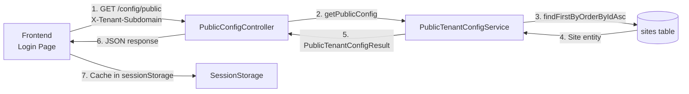

# Public Tenant Configuration

## Overview

Centralized API for serving **unauthenticated** tenant-specific configuration to frontend before login.

**Current configs**:
- reCAPTCHA (site key, enabled, threshold)

**Future configs**:
- Maintenance mode (enabled, message)
- Feature flags (chat, newsletter)

**Why**: Replaces scattered per-config endpoints with single extensible API.

## Architecture



### Source Files

| Layer | Component | Location |
|-------|-----------|----------|
| **Backend** | Controller | [`PublicConfigController.java`](../../backend/src/main/java/com/backend/presentation/controller/PublicConfigController.java) |
| | Service | [`PublicTenantConfigServiceImpl.java`](../../backend/src/main/java/com/backend/application/service/impl/PublicTenantConfigServiceImpl.java) |
| | DTOs | [`PublicTenantConfigResult.java`](../../backend/src/main/java/com/backend/application/dto/PublicTenantConfigResult.java), [`PublicTenantConfigResponse.java`](../../backend/src/main/java/com/backend/presentation/dto/response/PublicTenantConfigResponse.java) |
| **Frontend** | Service | [`public-tenant-config.service.ts`](../../storefront/src/app/core/config/public-tenant-config.service.ts) |
| | Types | [`public-tenant-config.types.ts`](../../storefront/src/app/core/config/public-tenant-config.types.ts) |
| | Endpoint | [`api-endpoints.ts`](../../storefront/src/app/modules/admin/api-endpoints.ts) (`publicTenantConfig`) |

## Key Principles

| Aspect | Rule | Details |
|--------|------|---------|
| **Authentication** | Not required | Public endpoint, no JWT needed |
| **Tenant Resolution** | Required | Via `X-Tenant-Subdomain` header or hostname |
| **Tenant Status** | Active only | Inactive tenants get default config |
| **Security** | No secrets exposed | Only public keys sent to client |
| **Fail Strategy** | Fail-open | Return default config if API fails |
| **Caching** | Frontend only | sessionStorage + memory Map |
| **Cache Key** | `public_tenant_config_{subdomain}` | Per-tenant isolation |
| **Clean Architecture** | Enforced | Application ↛ Presentation DTOs |

## Implementation

### Backend Pattern

**Service** (Application Layer):
```java
@Service
public class PublicTenantConfigServiceImpl implements PublicTenantConfigService {
    private final SiteRepository siteRepository;

    public PublicTenantConfigResult getPublicConfig() {
        return siteRepository.findFirstByOrderByIdAsc()
            .map(site -> PublicTenantConfigResult.of(
                site.getRecaptchaEnabled(),
                site.getRecaptchaSiteKey(),
                site.getRecaptchaThreshold()))
            .orElse(PublicTenantConfigResult.disabled());
    }
}
```

**Controller** (Presentation Layer):
```java
@RestController
@RequestMapping("/config")
public class PublicConfigController {
    private final PublicTenantConfigService service;

    @GetMapping("/public")  // No @PreAuthorize - public endpoint
    public ResponseEntity<ApiResponse<PublicTenantConfigResponse>> getPublicConfig() {
        try {
            var config = service.getPublicConfig();
            return ResponseEntity.ok(ApiResponse.success(
                PublicTenantConfigResponse.from(config)
            ));
        } catch (Exception e) {
            return ResponseEntity.ok(ApiResponse.success(
                PublicTenantConfigResponse.from(PublicTenantConfigResult.disabled())
            ));
        }
    }
}
```

### Frontend Pattern

**Service**:
```typescript
@Injectable({ providedIn: 'root' })
export class PublicTenantConfigService {
    loadConfig(subdomain: string): Observable<PublicTenantConfig> {
        const cached = this.#getCachedConfig(subdomain);
        if (cached) return of(cached);

        return this.#apiClient
            .custom('GET', 'publicTenantConfig', {
                customHeaders: { 'X-Tenant-Subdomain': subdomain }
            })
            .pipe(
                map(response => response.data),
                tap(config => this.#setCachedConfig(subdomain, config)),
                catchError(() => of(this.#getDefaultConfig()))
            );
    }
}
```

**Component**:
```typescript
export class SignInComponent implements OnInit {
    protected recaptchaConfigSig = signal<RecaptchaConfig | null>(null);

    ngOnInit(): void {
        const subdomain = this.#tenantContext.extractSubdomainFromHost();
        if (!subdomain || subdomain === 'admin') return;

        this.#publicConfigService.loadConfig(subdomain)
            .pipe(take(1))
            .subscribe(config => this.recaptchaConfigSig.set(config.recaptcha));
    }
}
```

## Common Pitfalls

| Issue | Problem | Solution |
|-------|---------|----------|
| **ApiResponse unwrapping** | Returns wrapper, not data | Use `map(response => response.data)` |
| **Tenant context** | Endpoint public but needs tenant | Still requires `X-Tenant-Subdomain` header |
| **Cache stale data** | Config not updated after change | Call `clearCache()` on tenant switch |
| **Hardcoded subdomain** | Using `getCurrentSubdomain()` before auth | Use `extractSubdomainFromHost()` instead |
| **Query subdomain fallback** | Accepting `?subdomain=` on auth pages can cause tenant ambiguity | Use hostname-only tenant resolution (fail-closed if host invalid) |

### Extensibility

**Adding new config section**:

```java
// Backend: PublicTenantConfigResult.java
public record PublicTenantConfigResult(
    RecaptchaConfig recaptcha,
    MaintenanceConfig maintenance  // New
) { }
```

```typescript
// Frontend: public-tenant-config.types.ts
export interface PublicTenantConfig {
    recaptcha: RecaptchaConfig;
    maintenance: MaintenanceConfig;  // New
}
```

## Testing

**Backend** (curl/Postman):
```bash
GET http://democompany.localhost:8080/api/config/public
X-Tenant-Subdomain: democompany

# Expected: { result: "SUCCESS", data: { recaptcha: {...} } }
```

**Frontend** (Browser DevTools):
1. Network tab → `/api/config/public` request
2. Application tab → sessionStorage → `public_tenant_config_democompany`
3. Console → Verify no errors

**Cache Test**:
- First load: API call made
- Second load: Cache hit (no API call)
- After `clearCache()`: API call made again

## Related Documentation

- **Authentication**: [`authentication.md`](authentication.md) - reCAPTCHA integration details
- **Security**: [`security-multi-tenancy.md`](security-multi-tenancy.md) - Public endpoint categorization
- **Frontend Patterns**: [`frontend-patterns.md`](frontend-patterns.md) - Service and caching patterns
- **Backend Patterns**: [`backend-patterns.md`](backend-patterns.md) - Clean Architecture layers
