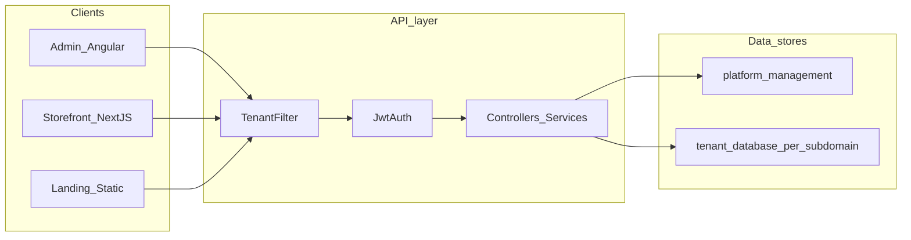

# Craftive — Customer Platform Capabilities Report

**Document type:** technical and commercial leave-behind (English)  
**Primary sources:** repository documentation under `docs/` (especially `docs/README.md`, `docs/marketing/strategy.md`, `docs/global/`, `docs/modules/`) and representative implementation files.  
**Public marketing reference:** [https://craftive.io/en/](https://craftive.io/en/) (reviewed for alignment with documented behavior).

---

## How to read this document

- **Purpose:** Help buyers, project sponsors, and technical evaluators understand what Craftive is, how it is structured, which problems it targets, and how security and tenancy are handled—without replacing legal, compliance, or procurement questionnaires your organization may require.
- **Scope:** Describes the **platform as implemented and documented in this repository** at the time of writing. Operational details (exact URLs, secrets, runbooks) live in `docs/global/devops.md` and related files.
- **Illustrative scenarios:** Names, domains, and numeric examples shown on the public marketing site (e.g. sample “MediCore”, “Lumena Store”, metrics such as product counts) are **fictional capability illustrations**, not verified customer references, unless your sales team provides signed-off case studies separately.

---

## 1. Executive summary

**What Craftive is**

Craftive is a **multi-tenant project platform** for delivering modular digital solutions—corporate sites, content hubs, headless catalog/storefront foundations, mail marketing, and agency-style rollouts—on a **shared technical foundation** with **database-per-tenant** isolation and **headless REST** delivery.

**What you buy (commercial model)**

Per [docs/marketing/strategy.md](./strategy.md), Craftive is positioned as **modular project solutions**, not a generic self-serve fixed SaaS package. Delivery typically includes:

- The **platform foundation** (control plane + tenant data plane patterns documented in `docs/README.md`).
- A **module set** matched to the use case (`core`, optional `product`, optional `mail_marketing`, with core execution capabilities such as page builder, media, and component library provisioned as part of `core` execution—see [Section 5](#5-modules-and-provisioning)).
- **Setup, configuration, and optional customization** (themes, storefront fork, integrations).
- **Operations and expansion** as agreed per project.

**Strong fit (from strategy)**

- Organizations needing corporate web / structured content operations.
- Teams wanting **tenant-isolated** operations and **headless** consumption of content and catalog data.
- Agencies delivering multiple client projects on a reusable base.

**Non-fit / expectation management**

- Not a “one-size subscription for everyone” product narrative; pricing and scope are **project-based** (strategy).
- Public CMS delivery is **read-oriented** and **tenant-scoped**; admin and provisioning APIs require authentication and appropriate roles (see [Section 4](#4-security-tenancy-and-trust)).

---

## 2. Solution areas (mapped to product building blocks)

The table below ties **business outcomes** to **documented platform areas**. Deep API lists live in the linked module docs.

| Solution story (strategy) | What the platform provides (docs/README.md + modules) |
|---------------------------|--------------------------------------------------------|
| **Corporate websites & content operations** | `core` execution path: Page Builder, Media Library, Component Library; navigation; ImpEx for structured data loads; **CMS delivery** for published content (`/api/cms/**`). |
| **Headless catalog & storefront foundation** | `product` module when enabled; **CMS delivery** product/category/search endpoints; **reference Next.js storefront** (`storefront-nextjs/`) consuming the same APIs—tenant themes fork the reference implementation. |
| **Mail marketing & campaigns** | Optional `mail_marketing` module; platform-level mail flows documented under platform admin / mail marketing modules. |
| **Agency delivery foundation** | SUPER_ADMIN provisioning; per-tenant DBs; module catalog; repeatable ImpEx + theme paths documented in `docs/README.md` (storefront seed notes). |

**Content model (business language)**

The marketing site describes a three-layer content architecture—**PageTemplate** (page skeleton and slots), **PageSlot** (named regions), **CmsComponent** (content units). That matches the platform’s CMS delivery and admin concepts documented in `docs/README.md` and `docs/modules/cms-delivery.md`: storefronts fetch **published** pages and components unless **preview** mode is explicitly activated with a valid preview ticket.

---

## 3. Architecture (trust-oriented)

**Clean Architecture (backend)**

The backend follows layered boundaries documented in [docs/global/architecture.md](../global/architecture.md):

- **Presentation:** HTTP controllers and request/response DTOs.
- **Application:** services and use-case orchestration.
- **Domain:** entities, enums, repository interfaces.
- **Infrastructure:** JPA, tenant routing, external adapters.

**Multi-tenancy: database-per-tenant**

- **Control plane:** `platform_management` — tenants, provisioning jobs, platform settings, SUPER_ADMIN operations.
- **Data plane:** one **physical tenant database** per tenant (`ac_subdomain_{id}` pattern per README/architecture docs).
- **Invariant:** tenant tables do **not** rely on a shared `tenant_id` column for isolation; isolation is by **separate databases** and strict **tenant context** before repository access ([docs/global/architecture.md](../global/architecture.md), [docs/global/security-multi-tenancy.md](../global/security-multi-tenancy.md)).

**API context path**

All servlet-mapped controllers sit under **`/api`** (`server.servlet.context-path`); e.g. a controller mapped to `/cms` is reached at `/api/cms` ([docs/global/architecture.md](../global/architecture.md)).

**Frontend surfaces (repository)**

- **`storefront/`** — Angular **admin** SPA (tenant users + SUPER_ADMIN flows per authentication docs).
- **`storefront-nextjs/`** — Next.js **reference / demo storefront** for headless CMS (and catalog when enabled).
- **`landing/`** — static marketing site for `craftive.io`, calling **platform-public** APIs (demo requests, newsletter) per `docs/README.md`.

---

## 4. Security, tenancy, and trust

This section summarizes **documented** controls. For auditor-style detail, use [docs/global/security-multi-tenancy.md](../global/security-multi-tenancy.md) and [docs/global/authentication.md](../global/authentication.md).

### 4.1 Tenant resolution and lifecycle

**Order of resolution** (simplified from security doc + `TenantFilter`):

1. **`X-Tenant-ID`** header (numeric platform tenant id), if present and valid.
2. Else **`X-Tenant-Subdomain`** header.
3. Else **hostname-based** resolution: first label of the host, with optional **`X-Forwarded-Host`** only when `app.tenant.trust-forwarded-host=true` (default **false** because forwarded headers are spoofable without a trusted edge).

**Explicit non-use of client-controlled headers for tenancy**

`Origin` and `Referer` are **not** used for tenant resolution (documented rationale: client-controlled). Comments in `TenantFilter` reinforce that hostname resolution must not depend on those headers.

**Tenant status**

Requests are rejected if the resolved tenant is not **`ACTIVE`**.

**Context clearing**

Tenant context and MDC are cleared in a **`finally`** block so threads do not leak tenant state across requests ([docs/global/security-multi-tenancy.md](../global/security-multi-tenancy.md)).

**JWT vs resolved tenant**

For authenticated non–SUPER_ADMIN traffic, the filter cross-checks JWT `tenantId` (when present) against the resolved tenant and returns **403** on mismatch (`TenantFilter`).

### 4.2 Endpoint classes (business language)

| Class | Meaning for customers |
|-------|------------------------|
| **Public, no tenant** | Health, OpenAPI (where enabled), config-auth, platform newsletter subscribe, platform demo requests, etc.—documented list in security doc; these paths bypass tenant DB selection in `TenantFilter`. |
| **Platform (SUPER_ADMIN)** | Tenant list, provisioning, most `/api/platform/**` operations—**no tenant database** for those requests; guarded as control plane. |
| **Config admin (`/api/config/admin/**`)** | Separate control panel path with JWT + role checks; tenant header mismatch rules apply for tenant-bound JWTs (SEC-106 pattern in `TenantFilter`). |
| **Tenant default** | All other APIs require a **resolved tenant** (except specific auth branches documented for login/refresh/forgot-password/verify-otp). |
| **Public tenant-scoped** | Example: `POST /api/public/contact-requests` — **no JWT**, but still **tenant-resolved** (headers/hostname), with optional reCAPTCHA and rate limits per environment docs. |
| **CMS delivery (`/api/cms/**`)** | **No end-user authentication**; still **tenant-scoped** so each storefront only sees its tenant’s published content (plus documented preview mechanics). |

### 4.3 Authentication highlights (admin)

From [docs/global/authentication.md](../global/authentication.md) (see file for full endpoint matrix):

- **Two login modes** on the same auth endpoints: **tenant user** vs **platform SUPER_ADMIN** (workspace/subdomain semantics in the Angular app).
- **Access token** kept in **memory** (signal) in the admin SPA; **refresh token** in **`HttpOnly` cookie** (`craftive_rt`) scoped to `/api/auth` — reduces XSS exposure to long-lived secrets.
- **Remember Me** changes refresh token TTL (documented durations).
- **Intercepts** retry refresh on **401** before forcing sign-out.
- **Hostname guard** prevents a tenant session from being treated as valid on platform admin hosts (`rootRedirectGuard` behavior per auth doc).

Platform **2FA policy** and **SUPER_ADMIN OTP** behavior are documented in the authentication module; config console uses a **separate** auth key/session (`/config`).

### 4.4 Abuse protection and rate limits

[docs/global/security-multi-tenancy.md](../global/security-multi-tenancy.md) documents Resilience4j **rate limiters** (fail-fast, HTTP **429**) for sensitive operations, including:

- ImpEx execution
- Demo request ingest (plus **deduplication** / constant-time success behavior for repeat submissions—see security doc SEC-107 narrative)
- Config admin reCAPTCHA patch throttling
- Entry field definition creation throttling

**CMS delivery** endpoints intentionally have **no** application-level global rate limiter (would penalize all users equally); the doc recommends **edge / Traefik per-IP** limiting if needed ([docs/modules/cms-delivery.md](../modules/cms-delivery.md)).

### 4.5 HTTP security headers (API)

`SecurityConfig` sets **defense-in-depth** headers on API responses, including **frame denial**, **CSP** (API-oriented directives), **referrer policy**, and **HSTS** on non-`dev` profiles. Admin and Next.js apps may receive additional CSP at **Traefik / CDN** ([docs/global/security-multi-tenancy.md](../global/security-multi-tenancy.md)).

### 4.6 Compliance language (careful framing)

- **Technical isolation:** separate tenant databases and tenant resolution rules are **architecture and implementation facts** documented in-repo.
- **Regulatory claims:** the public marketing site may use broad phrases (for example around GDPR). **This report does not certify legal compliance.** Map any regulatory requirement to **your** processes (DPA, subprocessors, data residency, DPIA) plus the technical measures described here and in `docs/global/devops.md` (hosting region, backups, logging redaction, etc.).

---

## 5. Modules and provisioning

**Provisioning-selectable modules** (catalog API): `core`, `product`, `mail_marketing` ([docs/modules/platform-provisioning.md](../modules/platform-provisioning.md), `ModuleCode`).

**Core execution modules** (migrations / runtime dependencies, not exposed as separate tenant “feature toggles” in the user-facing module list): `media`, `component_library`, `pagebuilder` — expanded when `core` is selected ([docs/README.md](../README.md), [docs/modules/platform-provisioning.md](../modules/platform-provisioning.md)).

**SUPER_ADMIN workflows** (high level)

1. Create tenant (`POST /api/tenants`).
2. Start provisioning job (`POST /api/provisioning/tenants/{tenantId}/provision`).
3. Poll job status (`GET /api/provisioning/jobs/{jobId}`).
4. Optional migration sync for existing tenants (`POST /api/provisioning/tenants/{tenantId}/sync-migrations`).

Provisioning endpoints are rate-limited (**5 requests/minute per tenant** per provisioning doc).

---

## 6. Public delivery, landing, and storefronts

### 6.1 CMS delivery (storefronts)

Documented in [docs/modules/cms-delivery.md](../modules/cms-delivery.md):

- **Pages, components, navigation, media, robots.txt, sitemap**—with published vs preview rules.
- **Language resolution:** `lang` query wins, else `Accept-Language`, else tenant default.
- **Batch limits** (e.g. up to **50** UIDs) enforced server-side.
- **Error contract:** some “not found” flows return **HTTP 200** with `result: "ERROR"` in the envelope—clients must check payload shape (documented).

### 6.2 Reference Next.js storefront

[`storefront-nextjs/README.md`](../../storefront-nextjs/README.md) describes:

- Locale-prefixed routing; loaders per page type.
- **Tenant** passed via env / headers as documented; `GET /api/cms/site` drives supported languages (also summarized in `docs/README.md`).
- Search Console verification is **per-deployment** in tenant forks.

### 6.3 Marketing landing (`landing/`)

Per `docs/README.md`:

- **Demo / contact:** `GET /api/platform/cms/config` then `POST /api/platform/public/demo-requests` with reCAPTCHA action `landing_demo_request` when enabled; `Accept-Language` aligned to page locale.
- **Newsletter:** `POST /api/platform/public/newsletter/subscribe` with honeypot and timing checks; **double opt-in** model (not platform reCAPTCHA-dependent).
- **CORS:** every browser **Origin** that loads the landing must be allowed in backend CORS config for the target profile—custom domains differ from `*.pages.dev` defaults.

---

## 7. Public marketing site vs documented platform

[https://craftive.io/en/](https://craftive.io/en/) is consistent with the repository’s **positioning** (“modular architecture”, “database isolation”, “headless REST”, multi-tenant admin at `app.craftive.io`, link to [https://docs.craftive.io/](https://docs.craftive.io/)).

**Where marketing generalizes**

| Marketing phrase (high level) | Documented / precise framing |
|------------------------------|------------------------------|
| “Full GDPR compliance” alongside DB isolation | Treat as **marketing shorthand**. Technically, the platform implements **separate databases per tenant** and documented security controls; **legal GDPR posture** depends on your deployment, contracts, and processes—not on this report. |
| “Zero data leakage risk” | Tenant isolation **materially reduces** cross-tenant data mixing vs shared-row models; absolute “zero risk” is not a engineering claim—defense is layered (DB isolation + authz + ops). |
| Numeric stats on sample brands | **Illustrative only** (see top of this document). |

**Where marketing aligns well**

- Three-layer content story matches CMS delivery + admin concepts.
- Module map (core content + optional catalog + mail) matches `ModuleCode` and README provisioning notes.
- “One deployment, many tenants” matches control-plane + per-tenant DB architecture.

---

## 8. Operations, environments, and observability

Summarized from [docs/global/devops.md](../global/devops.md):

- **Environments:** separate DigitalOcean droplets for **stage** and **prod**; Traefik; Docker Compose; Cloudflare in front.
- **Secrets & networking:** DB and admin ports not exposed publicly; SSH deploy user without sudo; production deploy gates via GitHub Environments.
- **TLS:** wildcard and DNS-01 constraints documented; Cloudflare SSL mode **Full (strict)** for prod noted as required for correct TLS validation.
- **Logging:** Alloy ships container logs to **Grafana Cloud Loki** with documented redaction patterns.
- **CORS:** profile-driven via `CorsProperties` / YAML—not hardcoded in `SecurityConfig`.

URLs for stage/prod API and admin hosts are listed in the DevOps doc (use that table rather than duplicating volatile values here).

---

## 9. Appendix

### 9.1 Glossary

| Term | Meaning |
|------|---------|
| **Tenant** | A customer project environment with its own subdomain, settings, and **dedicated database**. |
| **Control plane** | `platform_management` operations: tenants, provisioning, SUPER_ADMIN dashboards. |
| **Data plane** | Tenant database content: CMS, media metadata, products, mail entities, etc. |
| **CMS delivery** | Public, unauthenticated JSON endpoints scoped to a resolved tenant for storefront rendering. |
| **ImpEx** | Controlled SQL import executed **only** against the active tenant DB with strict guards (see `docs/modules/impex.md`). |

### 9.2 Key internal documentation index

- [docs/README.md](../README.md) — module map, landing/storefront notes, cross-links.
- [docs/marketing/strategy.md](./strategy.md) — positioning, sales model, GTM.
- [docs/global/architecture.md](../global/architecture.md) — layers, DB-per-tenant.
- [docs/global/security-multi-tenancy.md](../global/security-multi-tenancy.md) — tenant filter, rate limits, headers.
- [docs/global/authentication.md](../global/authentication.md) — JWT, cookies, guards, OTP notes.
- [docs/global/devops.md](../global/devops.md) — deploy, CORS, observability.
- [docs/modules/cms-delivery.md](../modules/cms-delivery.md) — public storefront API contract.
- [docs/modules/platform-provisioning.md](../modules/platform-provisioning.md) — provisioning API.
- [docs/modules/platform-admin.md](../modules/platform-admin.md) — dashboard, demo inbox, platform settings.

### 9.3 Relationship to sales collateral

This report is a **long-form English** companion to slide-based material such as [customer-presentation-deck-outline-tr.md](./customer-presentation-deck-outline-tr.md): use slides for narrative pacing; use this document for **procurement**, **security review kickoff**, and **architecture alignment** before deeper workshops.

---

*End of report.*
