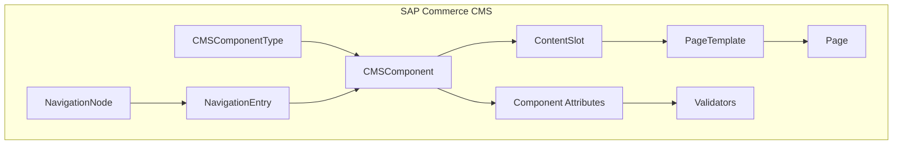
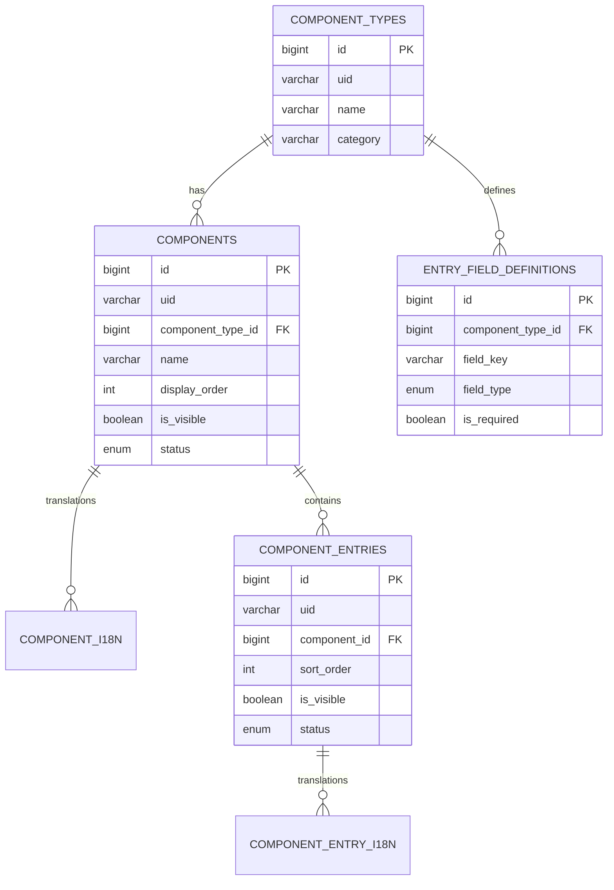

# SAP Commerce Cloud CMS vs AdminCraft Component Analysis

## 📊 Mevcut Yapı Karşılaştırması

### SAP Commerce Cloud CMS Mimarisi



| SAP Commerce Konsepti | Açıklama | AdminCraft Karşılığı |
|----------------------|----------|---------------------|
| **CMSComponentType** | Component türü tanımı (items.xml) | [ComponentType](file:///c:/Users/emreerkesikbas/Documents/AdminCraft/backend/src/main/java/com/backend/domain/entity/ComponentType.java#15-36) ✅ |
| **CMSComponent** | Component instance | [Component](file:///c:/Users/emreerkesikbas/Documents/AdminCraft/backend/src/main/java/com/backend/domain/entity/Component.java#20-57) ✅ |
| **Component Attributes** | Type'a ait field tanımları | [EntryFieldDefinition](file:///c:/Users/emreerkesikbas/Documents/AdminCraft/backend/src/main/java/com/backend/domain/entity/EntryFieldDefinition.java#14-72) ✅ |
| **ContentSlot** | Page'de component yerleştirme alanı | ❌ **YOK** |
| **PageTemplate** | Sayfa şablonu (slot tanımları) | ❌ **YOK** |
| **NavigationNode** | Navigasyon ağaç yapısı | ❌ **YOK** |
| **Restriction** | Component görünürlük kuralları | ❌ **YOK** |
| **Catalog/CatalogVersion** | Content versioning | ❌ **YOK** |

---

### AdminCraft Mevcut Component Mimarisi



---

## 🔍 Mevcut API Endpoints Analizi

### Component Endpoints

| Endpoint | Method | Açıklama | Response |
|----------|--------|----------|----------|
| `/api/components` | GET | Tüm componentleri listele | `ComponentListItemResponse[]` |
| `/api/components/{id}?include=translations` | GET | Component detay + i18n | `ComponentDetailResponse` |
| `/api/components` | POST | Yeni component oluştur | `ComponentResponse` |
| `/api/components/{id}` | PUT | Component güncelle | `ComponentResponse` |
| `/api/components/{id}` | DELETE | Component sil | - |

### Component Type Endpoints

| Endpoint | Method | Açıklama |
|----------|--------|----------|
| `/api/components/types` | GET | Tüm tipleri listele |
| `/api/components/types/{id}` | GET | Tip detay |
| `/api/components/types` | POST | Yeni tip oluştur |
| `/api/components/types/{id}` | PUT | Tip güncelle |
| `/api/components/types/{id}/entry-fields` | GET | Tipin field tanımları |

### Component Entry Endpoints

| Endpoint | Method | Açıklama |
|----------|--------|----------|
| `/api/components/{id}/entries` | GET | Component'in entry'leri |
| `/api/components/entries/{id}?include=translations` | GET | Entry detay |
| `/api/components/entries` | POST | Yeni entry |
| `/api/components/entries/{id}` | PUT | Entry güncelle |
| `/api/components/entries/{id}` | DELETE | Entry sil |

---

## 🎯 SAP Commerce'den İlham Alınabilecek Geliştirmeler

### 1. **Content Slot Sistemi** 🔴 High Priority

SAP Commerce'de her sayfa şablonu **content slot**'lardan oluşur. Componentler bu slot'lara yerleştirilir.

```typescript
// Öneri: ContentSlot entity
interface ContentSlot {
    id: number;
    uid: string;
    name: string;           // "HeaderSlot", "FooterSlot", "MainContentSlot"
    position: string;       // "header", "footer", "left", "right", "main"
    pageTemplateId: number;
    acceptedTypeIds: number[]; // Bu slot hangi component tiplerini kabul eder
    components: SlotComponent[]; // Slot'a atanmış componentler + sıralama
}

interface SlotComponent {
    slotId: number;
    componentId: number;
    position: number;
    restrictions?: ComponentRestriction[];
}
```

**Fayda**: Sayfa yapısını modüler hale getirir, drag-drop yerleştirme sağlar.

---

### 2. **Page Template Sistemi** 🔴 High Priority

SAP'da her page bir template'e bağlıdır ve template slot'ları tanımlar.

```typescript
interface PageTemplate {
    id: number;
    uid: string;
    name: string;           // "HomepageTemplate", "ProductPageTemplate"
    slots: TemplateSlot[];
    previewUrl?: string;
}

interface TemplateSlot {
    templateId: number;
    slotName: string;       // "HeaderSlot"
    position: string;       // "top", "bottom", "left", etc.
    allowedTypes: string[]; // ["header", "navigation", "hero"]
    maxComponents?: number;
}

// Page -> Template ilişkisi
interface Page {
    id: number;
    uid: string;
    templateId: number;
    contentSlots: PageSlot[];
}
```

**Fayda**: Tutarlı sayfa yapısı, slot bazlı component yönetimi.

---

### 3. **Component Restriction Sistemi** 🟡 Medium Priority

SAP Commerce'de componentler koşullu olarak gösterilebilir.

```typescript
interface ComponentRestriction {
    id: number;
    type: 'TIME' | 'USER_GROUP' | 'DEVICE' | 'COUNTRY' | 'CATEGORY';
    component?: Component;
    slot?: ContentSlot;
    params: RestrictionParams;
}

// Örnek: Sadece mobilde göster
{
    type: 'DEVICE',
    params: { devices: ['mobile', 'tablet'] }
}

// Örnek: Belirli tarih aralığında göster
{
    type: 'TIME',
    params: { startDate: '2025-01-01', endDate: '2025-01-31' }
}

// Örnek: Sadece giriş yapmış kullanıcıya göster
{
    type: 'USER_GROUP',
    params: { groups: ['registered', 'premium'] }
}
```

**Fayda**: A/B test, kampanya yönetimi, kişiselleştirme.

---

### 4. **Navigation Node Hiyerarşisi** 🟡 Medium Priority

SAP Commerce'de navigasyon ağaç yapısındadır.

```typescript
interface NavigationNode {
    id: number;
    uid: string;
    name: string;
    parentId?: number;      // Hiyerarşi için
    children?: NavigationNode[];
    entries: NavigationEntry[];
    visible: boolean;
    sortOrder: number;
}

interface NavigationEntry {
    nodeId: number;
    itemType: 'PAGE' | 'URL' | 'COMPONENT' | 'CATEGORY';
    itemId?: number;        // Page ID, Component ID, etc.
    url?: string;           // External URL
    name: string;
    visible: boolean;
}
```

**Fayda**: Dinamik menü yapısı, mega menü desteği.

---

### 5. **Component Versioning / Catalog System** 🟢 Low Priority

SAP Commerce'de "Staged" ve "Online" content catalog'ları vardır.

```typescript
interface ContentCatalog {
    id: number;
    name: string;           // "Content Catalog"
    versions: CatalogVersion[];
}

interface CatalogVersion {
    id: number;
    catalogId: number;
    version: 'STAGED' | 'ONLINE';
    active: boolean;
}

// Her component bir catalog versiyonuna ait
interface Component {
    // ...mevcut alanlar
    catalogVersionId: number;
}

// Sync işlemi: STAGED -> ONLINE
interface SyncJob {
    sourceCatalogVersion: 'STAGED';
    targetCatalogVersion: 'ONLINE';
    items: SyncItem[];
    status: 'PENDING' | 'RUNNING' | 'COMPLETED' | 'FAILED';
}
```

**Fayda**: İçerik onay süreçleri, preview, rollback.

---

### 6. **Entry Field Type Genişletme** 🟡 Medium Priority

Mevcut field tipleri sınırlı. SAP tarzı genişletme:

```typescript
// Mevcut tipler
type EntryFieldType = 'TEXT' | 'TEXTAREA' | 'NUMBER' | 'BOOLEAN';

// Önerilen yeni tipler
type ExtendedFieldType = 
    | 'TEXT' 
    | 'TEXTAREA' 
    | 'RICHTEXT'      // HTML editor
    | 'NUMBER' 
    | 'DECIMAL'
    | 'BOOLEAN' 
    | 'DATE'
    | 'DATETIME'
    | 'MEDIA'         // Resim/video seçici
    | 'LINK'          // URL + label
    | 'SELECT'        // Dropdown (options tanımı)
    | 'MULTISELECT'   // Çoklu seçim
    | 'COLOR'         // Renk seçici
    | 'JSON'          // Serbest JSON data
    | 'REFERENCE';    // Başka bir entity'ye referans
```

**Field Definition Genişletme:**

```java
@Entity
public class EntryFieldDefinition {
    // ...mevcut alanlar
    
    @Column(name = "options_json", columnDefinition = "JSON")
    private String optionsJson;  // SELECT/MULTISELECT için seçenekler
    
    @Column(name = "reference_type")
    private String referenceType; // REFERENCE için: "Product", "Category", etc.
    
    @Column(name = "default_value")
    private String defaultValue;
    
    @Column(name = "placeholder")
    private String placeholder;
    
    @Column(name = "help_text")
    private String helpText;
    
    @Column(name = "group_name")
    private String groupName;    // Field'ları gruplama için
    
    @Column(name = "display_order")
    private Integer displayOrder;
}
```

---

### 7. **Component Rendering API** 🔴 High Priority

SAP Commerce'de componentler render edilebilir data döner.

```typescript
// GET /api/components/{id}/render?language=TR
interface RenderResponse {
    uid: string;
    type: string;
    props: Record<string, any>;  // Tüm field değerleri düzleştirilmiş
    entries?: EntryRenderData[];
}

interface EntryRenderData {
    uid: string;
    index: number;
    props: Record<string, any>;
}
```

**Örnek Response:**

```json
{
    "uid": "cmsitem_79583443",
    "type": "Footer",
    "props": {
        "title": "test footer en",
        "isVisible": true,
        "styleClasses": null
    },
    "entries": [
        {
            "uid": "cmsitem_36792026",
            "index": 0,
            "props": {
                "title": "Entry 1 Title",
                "test": "custom field value"
            }
        }
    ]
}
```

**Fayda**: Frontend'e render-ready data, daha az client-side işlem.

---

### 8. **Bulk Operations** 🟢 Low Priority

Toplu işlemler için API'ler:

```typescript
// POST /api/components/bulk-status
interface BulkStatusRequest {
    componentIds: number[];
    status: 'DRAFT' | 'ACTIVE' | 'INACTIVE';
}

// POST /api/components/bulk-delete
interface BulkDeleteRequest {
    componentIds: number[];
}

// POST /api/components/bulk-clone
interface BulkCloneRequest {
    componentIds: number[];
    targetCatalogVersionId?: number;
}
```

---

## 📋 Öncelik Sıralaması

| # | Geliştirme | Öncelik | Effort | Fayda |
|---|-----------|---------|--------|-------|
| 1 | **Content Slot Sistemi** | 🔴 High | Large | Sayfa yapısı modülerliği |
| 2 | **Page Template Sistemi** | 🔴 High | Large | Tutarlı sayfa yapısı |
| 3 | **Component Rendering API** | 🔴 High | Medium | Frontend performans |
| 4 | **Entry Field Type Genişletme** | 🟡 Medium | Medium | Daha zengin içerik |
| 5 | **Navigation Node Hiyerarşisi** | 🟡 Medium | Medium | Dinamik menüler |
| 6 | **Component Restriction** | 🟡 Medium | Medium | Kişiselleştirme |
| 7 | **Content Versioning** | 🟢 Low | Large | İçerik onay süreci |
| 8 | **Bulk Operations** | 🟢 Low | Small | Operasyonel verimlilik |

---

## 🚀 Önerilen Roadmap

### Sprint 25: Core Infrastructure
- [ ] Content Slot entity + CRUD
- [ ] Page Template entity + CRUD
- [ ] Component → Slot ilişkisi
- [ ] Component Rendering API

### Sprint 26: Enhanced Fields
- [ ] Entry Field Type genişletme (MEDIA, RICHTEXT, SELECT)
- [ ] Field grouping
- [ ] Field validation enhancements
- [ ] Field ordering

### Sprint 27: Navigation & Restrictions
- [ ] Navigation Node hiyerarşisi
- [ ] Navigation Entry yönetimi
- [ ] Basic Restriction sistemi (TIME, DEVICE)

### Sprint 28: Advanced Features
- [ ] Content Catalog + Versioning
- [ ] Sync işlemleri (STAGED → ONLINE)
- [ ] Bulk operations
- [ ] Advanced Restrictions (USER_GROUP)

---

## ❓ Karar Noktaları

1. **Content Slot yaklaşımı**: 
   - SAP tarzı ayrı slot tablosu mu?
   - Yoksa Page entity içinde JSON slot tanımı mı?

2. **Page yönetimi**: 
   - Mevcut `pages` modülü ile entegrasyon nasıl olacak?
   - PageBuilder ile çakışma var mı?

3. **Versioning scope'u**:
   - Tüm modüller için mi sadece components için mi?
   - Database level snapshot mı yoksa row-based versioning mi?

4. **Navigation kaynağı**:
   - Ayrı Navigation modülü mü?
   - Yoksa Component Entries içinde navigation tipi mi?

---

## 📂 Mevcut Kod Review Özeti

### ✅ Güçlü Yönler

1. **Clean Architecture**: Domain-Application-Presentation katmanları düzgün ayrılmış
2. **Multi-tenant support**: TenantContext ve database-per-tenant pattern
3. **i18n yapısı**: Component ve Entry seviyesinde translation support
4. **Dynamic fields**: EntryFieldDefinition ile runtime schema tanımı
5. **API Standard**: ApiResponse wrapper, consistent error handling

### ⚠️ İyileştirme Alanları

1. **Component-Page ilişkisi yok**: Component'ler bağımsız, sayfa yapısına bağlanamıyor
2. **Slot konsepti eksik**: Componentlerin sayfada nereye konulacağı belirsiz
3. **Rendering API yok**: Frontend tüm transform işlemini yapıyor
4. **Field tipleri sınırlı**: Sadece 4 temel tip (text, textarea, number, boolean)
5. **Navigation desteği yok**: Menü yapısı component dışı

---

> **Sonuç**: AdminCraft'ın component modülü SAP Commerce'in temel yapısını (ComponentType → Component → Entry) iyi karşılıyor. Ancak **Content Slot**, **Page Template** ve **Navigation Node** gibi üst seviye yapılarla zenginleştirilebilir.
